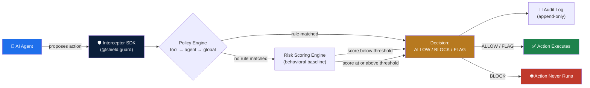
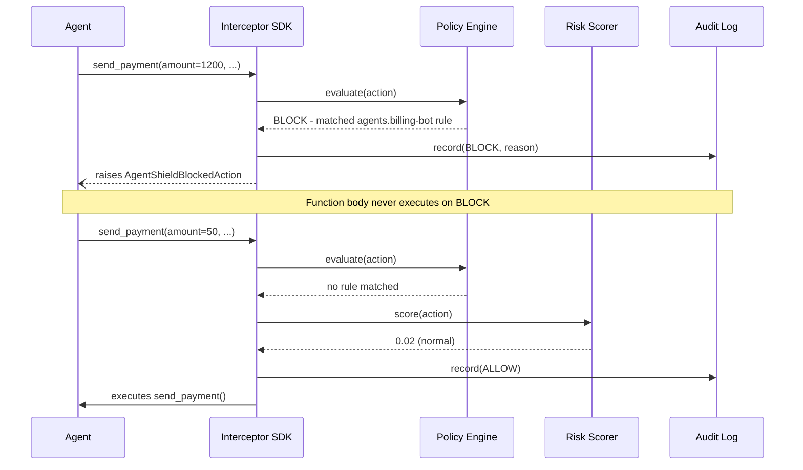

<div align="center">

# 🛡️ AgentShield

**An open-source safety and audit firewall for autonomous AI agents.**

AgentShield sits between your AI agent and the real-world actions it takes — payments, emails, file operations, API calls — and evaluates every single one against configurable policies and a behavioral risk score, **before it executes.**

[](LICENSE)
[](https://www.python.org/downloads/)
[](https://github.com/DhruvPatel6429/agentshield/actions/workflows/tests.yml)
[](CONTRIBUTING.md)
[](#-adapters)

[**🎥 Watch the 40-second demo**](https://www.loom.com/share/f292be137609472b83f00c642ceaef41) · [Quickstart](#-quickstart) · [Architecture](#%EF%B8%8F-architecture) · [Contributing](#-contributing)

</div>

---

## The problem

AI agents are now being handed real permissions — spending money, deleting files, calling third-party APIs, deploying code — with almost no safety layer between an agent's decision and its real-world execution. A single hallucinated or manipulated agent action can mean a financial loss, a data leak, or irreversible damage, and today most teams have **zero visibility** into it until after the fact.

AgentShield is a free, framework-agnostic, self-hostable way to say *"an agent must never do X"* and have it actually enforced — with a complete audit trail of everything an agent attempted, allowed or not.

## Quick example

```python
from agentshield import AgentShield, AgentShieldBlockedAction

shield = AgentShield(policy_path="policies/default.yaml")

@shield.guard(agent_id="billing-bot")
def send_payment(amount: float, currency: str, recipient: str) -> str:
    return f"Sent {amount} {currency} to {recipient}"

send_payment(amount=1200, currency="USD", recipient="unknown@example.com")
# -> AgentShieldBlockedAction: amount 1200 exceeds billing-bot's $500 limit
```

That's the entire integration. No agent framework rewrite, no separate service required to get started.

## ✨ Features

| | |
|---|---|
| 🧩 **Framework-agnostic core** | Guard any Python callable with one decorator — works standalone or with LangChain tools |
| 📜 **Declarative YAML policies** | Define rules at global, per-agent, or per-tool scope — no code changes to update a limit |
| 🧠 **Behavioral risk scoring** | Flags actions that are technically "allowed" but statistically unusual for that agent's history |
| 🧾 **Immutable audit log** | Every evaluated action is recorded — append-only, exportable, built for compliance review |
| ⚡ **Fail-safe by default** | If any internal component errors, AgentShield defaults to blocking — never fails open |
| 🪶 **Zero heavy dependencies** | Core install is just PyYAML; XGBoost/SHAP-based scoring is an optional extra |
| 🔌 **LangChain adapter included** | Wrap existing `Tool` / `StructuredTool` objects in one line |
| 🏠 **Fully self-hostable** | No mandatory SaaS, no phoning home, no vendor lock-in |

## 🏗️ Architecture



### Request lifecycle



## 📦 Install

```bash
pip install -e .            # core (PyYAML only)
pip install -e ".[dev]"     # + pytest, for running the test suite
pip install -e ".[ml]"      # + xgboost/shap, for the optional higher-fidelity risk scorer
```

## 🚀 Quickstart

```bash
python examples/quickstart.py
```

This wraps two example agent tools with a policy that caps `billing-bot` at $500/action and always flags file deletions, then shows an allowed call, a blocked call, and a flagged call — plus the resulting audit log:

```
1) A normal, small payment (should be ALLOWED):
   -> Sent 50 USD to vendor@example.com

2) A payment over billing-bot's $500 limit (should be BLOCKED):
   -> Blocked as expected: Action 'send_payment' was BLOCKED by AgentShield
      (policy: agents.billing-bot). Reason: amount gt 500 (actual: 1200)

3) A file deletion (policy says: always FLAG, but still executes):
   -> Deleted /tmp/old_report.csv
```

## 🔍 How it works

1. **Interceptor** — the `@shield.guard()` decorator wraps any function (or a LangChain tool via `agentshield.adapters.wrap_langchain_tool`) and captures every call's arguments before the function body runs.
2. **Policy Engine** — evaluates the captured arguments against YAML rules, in order of precedence: **tool-specific → agent-specific → global**. See [`policies/default.yaml`](policies/default.yaml) for a full annotated example.
3. **Risk Scorer** — even actions no explicit rule blocks are scored against that agent's historical behavioral baseline; a high anomaly score auto-escalates an action to `FLAG` for human review.
4. **Audit Log** — every evaluated action is recorded (append-only), regardless of outcome.

### Example policy

```yaml
agents:
  billing-bot:
    - field: amount
      operator: gt
      value: 500
      action_on_match: block

tools:
  delete_file:
    - field: path
      operator: regex
      value: ".*"
      action_on_match: flag   # always visible in the audit trail, never silent
```

## 🔌 Adapters

```python
from agentshield.adapters import wrap_langchain_tool, guard_langchain_tools

guarded_tool = wrap_langchain_tool(payment_tool, shield, agent_id="billing-bot")
guarded_tools = guard_langchain_tools([tool_a, tool_b], shield, agent_id="research-bot")
```

More framework adapters (AutoGPT-style stacks, JS/TS agents) are on the roadmap — see below, and [contributions are very welcome](#-contributing).

## 📁 Project layout

```
agentshield/
├── .github/workflows/tests.yml   # CI - runs the full suite on every push
├── pyproject.toml
├── README.md
├── LICENSE
├── policies/
│   └── default.yaml              # example policy file (annotated)
├── src/agentshield/
│   ├── __init__.py                # public API
│   ├── schemas.py                  # Action, Decision, EvaluationResult
│   ├── exceptions.py
│   ├── policy_engine.py            # YAML rule loading + evaluation
│   ├── risk_scoring.py             # BaselineRiskScorer + pluggable interface
│   ├── audit_log.py                 # append-only event log
│   ├── interceptor.py               # AgentShield class + @guard() decorator
│   └── adapters/
│       └── langchain_adapter.py    # wrap_langchain_tool / guard_langchain_tools
├── tests/                          # 36 tests, run on every push via CI
└── examples/
    └── quickstart.py
```

## 🧪 Running tests

```bash
pytest tests/ -v
```

## 🗺️ Roadmap

- [x] v1 - core interceptor + policy engine + LangChain adapter
- [ ] v2 - web dashboard + audit log export
- [ ] v2 - XGBoost + SHAP risk scorer as an opt-in upgrade
- [ ] v3 - JS/TS agent framework adapters
- [ ] v3 - Slack/email alerting on FLAGGED events

Have an idea or a framework you'd like supported? [Open an issue](../../issues) - this project is shaped by what real agent builders actually need.

## 🤝 Contributing

Contributions, issues, and feature requests are genuinely welcome. If you're integrating AgentShield with a framework not yet supported, a new adapter is one of the highest-impact PRs you can send - the adapter interface (`RiskScorer` / framework adapter pattern) is designed to be extended without touching core engine code.

1. Fork the repo and create a branch
2. Add tests for any new behavior (`pytest tests/ -v` should stay green)
3. Open a PR - CI will run automatically

## ⭐ Star History

[](https://star-history.com/#DhruvPatel6429/agentshield&Date)

## License

MIT (c) Dhruv Patel - see [LICENSE](LICENSE)